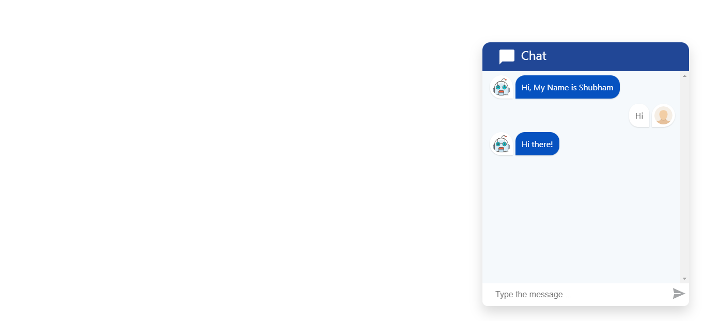

# Chat Bot

A simple Chat Bot React component that gives a user-friendly user interface to your application, and easily engages user interactions with reply different answers for single input.

**Live Preview**: https://shubhamkhan.github.io/Chat-Bot/

## Gen AI Version (New Update)
This chatbot is the base model.
I have also implemented an AI-powered Gen AI Chatbot, customized with my personal and professional details to deliver more intelligent and contextual responses.

**Try the Gen AI Chatbot here**: https://shubhamkhan.vercel.app/

## Technology used

* HTML
* CSS
* React JS
* Node JS
* OPEN AI API

## Introduction

Designed a robust, user-friendly user interface to engage user interactions, and used different answers for one input. Utilized user input and provided multiple types of feedback responses, such as text, YouTube videos, and links

## Run Locally

To run this web app locally, simply follow these steps:

- Clone this repository with the following command:-

```
git clone https://github.com/shubhamkhan/Chat-Bot.git
```

- Run npm install to install all the dependencies:-

```
npm install
```

- Run npm start to start the app on port 3000:-

```
npm start
```

**Note**:- You need to have Node.js installed on your local machine to run this app locally.

# Screenshot
* Desktop View 1
---

---
* Desktop View 2
---

---
* Mobile View 1
---

---
* Mobile View 2
---


# License

[MIT License](https://github.com/shubhamkhan/Chat-Bot/blob/master/LICENSE) @ [Shubham Khan](https://github.com/shubhamkhan/)
