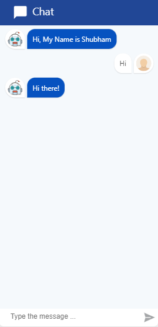

# Chat Bot

A simple Chat Bot React component that give user-friendly user interface to your application, and easily engage user interactions with reply different answers for single input.

**Live Preview**: https://shubhamkhan.github.io/Chat-Bot/

## Technology used

* HTML
* CSS
* React JS
* Node JS

## Introduction

Designed robust user-friendly user interface to engage user interactions, and used different answers for a one input. Utilized user input and provided multiple types of feedback responses such as text, YouTube videos, and links

## Run Locally

To run this web app locally, simply follow these steps:

- Clone this repository with the following command :-

```
git clone https://github.com/shubhamkhan/Chat-Bot.git
```

- Run npm install to install all the dependencies:-

```
npm install
```

- Run npm start to start the app on port 3000:-

```
npm start
```

**Note** :- You need to have node.js installed on your local machine to run this app locally.

# Screenshot



# License

[MIT License](https://github.com/shubhamkhan/Chat-Bot/blob/master/LICENSE) @ [Shubham Khan](https://github.com/shubhamkhan/)
